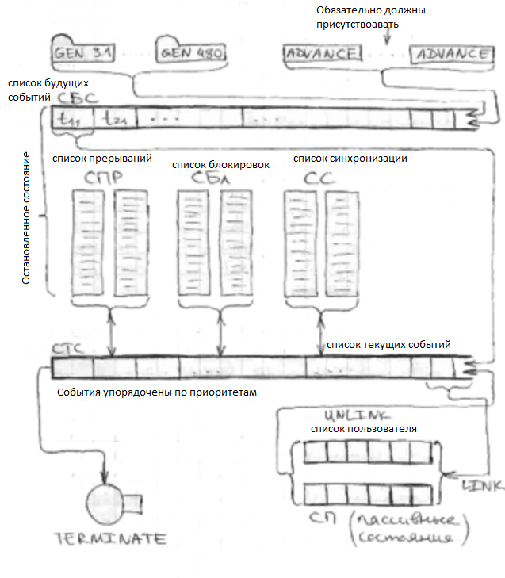

# General Purpose System Simulation (GPSS)
  GPSS – общецелевая система моделирования, как и любой язык, он содержит словарь и грамматику, с помощью которых легко могут быть разработаны точные модели систем определенного типа.

  Любой пакет в нем построен в предположении что моделью сложной дискретной системы является описание ее элементов и логических правил, взаимодействия в процессе функционирования. Для определения класса моделирования системы можно выделить конечный набор абстрактных элементов, называемых объектами. Набор логических правил также ограничен и может быть описан небольшим числом стандартных операций.
  
  Для облегчения процесса построения модели разработан так называемый язык блок-диаграмм, который позволяет упростить переход от алгоритма, определяющего процесс функционирования, к модели.
  
  Основой пакета является программа, описывающая функционирование выделенного ограниченного набора объектов, и специальная диспетчеризирующая программа, которая называется симулятор и выполняет следующие функции:
  * обеспечение заданных маршрутов продвижения динамических объектов
  * планирования событий, происходящих в модели путем регистрации времени каждого события и выполнение их в нарастающей временной последовательности
  * регистрация статистической информации по функционированию модели
  * продвижение модельного времени
  
  GPSS World поддерживает широкое использование **выражений**. Они могут использоваться в
PLUS-процедурах или в операторах GPSS (если заключены в скобки). Это означает, что в
операндах блоков и команд могут производиться эффективные вычисления. Выражения
могут производить простые вычисления, вызывать процедуры, выполняющие
математические или строковые операции, производить выбор вероятностного распределения
или выполнять заданные пользователем алгоритмы, включая файловый ввод-вывод.

## Объекты языка подразделяются на 7 категорий и 14 типов:

  Категория | Тип
 ------------ | ------------
  Динамическая | Транзакт
  Операционная | Блоки
  Аппаратная | Устройства памяти, ключи, (?) одноканальные устройства
  Вычислительная | Переменные, арифметические\логические функции, (?) генераторы случайных чисел
  Статистическая | Очереди, таблицы
  Запоминающия | Ячейки, матрицы ячеек
  Группирующия | Списки, группы
  
  **Динамическимие объекты** - транзакты (сообщения), которые представляют собой единицы исследуемых потоков и производят ряд определенных действий, продвигаясь по фиксированной структуре, представляющей собой совокупность объектов других категорий.
  
  **Операционные объекты** задают логику функционирования системы и определяют маршрут движения транзактов между объектами аппаратной категории.
  
  **Аппаратные объекты** – абстрактные элементы, на которых может быть декомпозировано оборудование реальной системы. Воздействуя на эти объекты, транзакты могут изменять их состояния и влиять на движение других транзактов.
  
  **Вычислительная категория** – служит для описания таких ситуаций в процессе моделирования, когда связи между компонентами моделируемой системы наиболее просто и компактно выражаются в виде математических соотношений.
  
  **Статистический объект** - очередь\таблица, служащая для оценоки поведения системы.
  
  **Объекты запоминающей категории** обеспечивают обращения к сохраняемым значениям. Ячейки сохраняемых величин и матрицы ячеек сохраняемых величин используются для сохранения некоторой числовой информации. Любой активный транзакт может произвести запись информации в эти объекты. Впоследствии записанную в эти объекты информацию может считать любой транзакт.
  
  **Группирующая категории** состоит из трёх типов объектов: числовых групп, групп транзактов и списков.(?)
  
  **Очереди** – в любой системе движение потоков транзактов может быть задержано из-за недоступности ресурсов, например, необходимое устройство уже занято. Как правило, это многоканальные устройства. В этом случае задержанные транзакты становятся в очередь. Учет этих очередей составляет одну их основных функций интерпретатора. Пользователь может специально определить точки модели, в которых необходимо собирать статистику об очередях, т.е. установить регистраторы очереди. В этом случае интерпретатор автоматически собирает статистику об очередях – длина, среднее время нахождения в очереди, и т.д. Вся эта информация является стандартным числовым атрибутом (СЧА). И она доступна пользователю в процессе моделирования. Интерпретатором также автоматически поддерживается дисциплина обслуживания FIFO. Пользователь может получить стандартную статистическую информацию только о таких очередях. Если же есть необходимость организовать очередь из транзактов другой дисциплины обслуживания, то для этого используются списки пользователя. Эти списки также помогают осуществить синхронизацию движения разных транзактов по модели.
  
  **Таблица** состоит из частотных классов, в которые заносится число попаданий конкретной величины (СЧА). Вычисляется математическое ожидание и среднеквадратичное отклонение. 
  
  В процессе моделирования системы одни объекты взаимодействуют с другими, в результате чего происходят изменения атрибутов и преобразование их значений. Такие преобразования – **события**.
  
  **Транзакты** моделируют прохождение по системе соответствующих единиц исследуемого потока. Такое движение может быть разбито на ряд элементарных событий, происходящих в определенные моменты времени.Основной задачей **имитатора** является распределение этих событий, расположение их в правильной временной последовательности и выполнение соответствующих действий при наступлении каждого события. Все отрезки времени описываются целыми числами. При составлении модели необходимо провести временное масштабирование, для всех временных параметров.
  
**Транзакты** представляют собой описание динамических процессов в реальных системах. Они могут описывать как реальные физические объекты, так и не физические(например, канальная программа). Их можно генерировать и уничтожать. Основным атрибутом транзакта являются его параметры, число которых для каждого колеблется от 0 до 1020.Pi. I–номер,  p–тип. Слово(W), полуслово(H), байт(B), плавающая точка(L). Когда два транзакта соперничают при занятии какого-либо места, первым обрабатывается тот, у которого приоритет выше. Если они одинаковые, то сначала тот, у которого время ожидания обработки больше.

В одном задании может выполняться как один так и несколько прогонов модели. При этом текущем значением абсолютного времени модели будет называться суммарное время по всем реализованным прогонам –A1, а текущем значением относительного времени –C1, системное время в пределах одного прогона.

## Управление процессом моделирования 

В системе GPSS интерпретатор (программа управления моделированием) поддерживает сложные структуры организации списков

  
В системе GPSS **интерпретатор(программа управления моделированием ПУМ)** поддерживает сложные структуры организации списков . С целью уменьшения затрат компьютерного времени на просмотр списков система GPSS ведет два основных списка событий. Первым является список текущих событий (СТС), куда входят все события, запланированные на текущий момент модельного времени независимо от того, условные они или безусловные. Программа управления моделированием просматривает в первую очередь этот список и пытается переместить по модели те транзакты, для которых выполнены условия. Если в этом списке таких транзактов нет, то ПУМ обращается к другому списку - списку будущих событий (СБС). Она переносит все события, которые запланированы на ближайший момент модельного времени, из этого списка в СТС и повторяет его просмотр. Такой перенос осуществляется также в случае совпадения текущего времени моделирования со временем первего события в списке будущих событий.

В СТС транзакты размещены в порядке уменьшения приоритетов (то есть транзакты с более высоким приоритетом размещены ближе к началу списка). Транзакты с одинаковыми приоритетами размещаются в соответствии с последовательностью поступления в список. Каждый транзакт в СТС может находиться или в активном состояния (то есть просматриваться ПУМ в данный момент модельного времени), или в состоянии задержки.

В начальный момент (при выполнении оператора управление START, который начинает фазу интерпретации GPSS-модели) ПУМ обращается ко всем блокам GENERATE модели. Каждый из этих блоков планирует момент появления транзактов и заносит их в СБС после чего ПУМ обращается к СТС. Так как в этом списке пока что отсутствуют транзакты, то ПУМ просматривает СБС и выбирает из него все транзакты, запланированные на ближайший момент времени и переносит их в СТС, после чего пытается продвинуть первый транзакт этого списка по блокам модели. Если перемещение транзакта было задержано по какой-либо причине, не связанной с блоком ADVANCE, то он остается в СТС и ПУМ пробует перемещать такой транзакт из этого списка далее по блокам. Если транзакт вошел в блок ADVANCE, то планируется его выход из этого блока и транзакт переносится в СБС.

В организации эффективной процедуры просмотра важен порядок просмотра транзактов, движение которых заблокировано (например, ввиду занятости некоторого ресурса). Простейшим решением является пересмотр всех заблокированных транзактов для каждого нового значения модельного времени и выбор тех, для которых сняты условия блокировок. Если моделируемая система перегружена, то этот способ с точки зрения затрат компьютерного времени невыгоден, так как каждый транзакт пересматривается многократно до того, как выйдет из состояния блокирования.

Если причина перевода транзактов в состояние блокирования - состояние определенного ресурса системы в данный момент времени, то намного более эффективным является способ обработки, по которому заблокированные по этой причине транзакты вообще не пересматриваются до тех пор, пока не изменится состояние соответствующего ресурса. Такой способ может быть реализован, например, регистрацией для каждой единицы ресурса транзактов, движение которых заблокировано ввиду состояния именно этого ресурса в данный момент времени. В момент, когда изменяется состояние этого ресурса, необходимо сразу же просмотреть транзакты, которые этого ожидают, и продолжить их обработку.

Если транзакты находятся в активном состоянии, то процедура просмотра пытается переместить их к следующим блокам. Если перемещение транзакта блокируется каким-нибудь ресурсом ввиду его занятости, то вхождение в следующий блок невозможно и транзакт переводится в состояние задержки. Такие транзакты не просматриваются и размещаются в соответствующем списке задержки.

Если при обслуживании текущего активного транзакта произошло изменение состояния ресурса, пересмотр начинается сначала, и опять обслуживаются все транзакты из СТС, которые находятся в активном состоянии. Если изменение списков ресурсов не произошло, ПУМ опять обращается к СТС и проверяет, не остались ли в нем транзакты, которые необходимо обработать.

**Список блокировок** — это список транзактов, которые ожидают изменения состояния ресурса. Существует шесть видов таких списков, связанных с устройствами; семь видов, связанных с **МКУ (многоканальными устройствами)**, и два вида, связанных с логическими ключами. С устройствами используются списки для занятых и незанятых, доступных и недоступных устройств и устройств, работающих без прерываний и с прерываниями. С МКУ используются списки для заполненного, незаполненного, пустого, непустого, доступного, недоступного МКУ и транзактов, которые могут войти в МКУ. С логическими ключами связаны списки для включенных и выключенных ключей.

Кроме двух основных списков СТС и СБС существует **список прерываний** (СПР), содержащий прерванные во время обслуживания транзакты, а также транзакты, вызвавшие прерывание. Список прерываний используется для организации обслуживания одноканальых устройств по абсолютным приоритетам. Это дает возможность организовать приоритетные дисциплины обслуживания транзактов в устройствах.

**Список синхронизации** (СС) содержит транзакты, которые на данный момент времени сравниваются. Этот список работает с транзактами, полученными с помощью блока SPLIT, который создает транзакты-копии, принадлежащие одному семейству или ансамблю. Синхронизацию движения транзактов одного семейства выполняют следующие блоки: MATCH (синхронизирует движение транзактов с другим блоком), ASSEMBLE (собирает все транзакты-копии и выдает один начальный транзакт), GATHER (собирает заданное количество транзактов и задерживает копии до тех пор, пока не соберется необходимое количество копий транзактов). Блок SPLIT можно использовать многократно.

Остановленные процессы находятся в СБС, СС и списках блокировок.

**Список пользователя** (СП) содержит транзакты, выведенные пользователем из СТС с помощью блока LINK и помещенные в СП как временно неактивные (переведенные пользователем в пассивное состояние). При работе ПУМ они ей недоступны до тех пор, пока не будут возвращены пользователем в СТС с помощью блока UNLINK.

## Классификация блоков GPSS

Блоки, используются для описания функций и управляют движением транзактов. У каждого блока имеется 2 стандартных числовых атрибута(СЧА):

Wn–счетчик входа в блок. Как правило номер транзакта, входящего в данный блок.

Nn–Общий счетчик транзактов, поступивших в блок с начального момента моделирования.
  
Практически все изменения состояния модели возникают в результате поступления транзактов в соответствующие блоки. После выполнения блока транзакт либо движется к следующему блоку, либо задерживается, либо уничтожается. Блоки изменияют атрибуты транзакта.

### 1. Блоки осуществляющие модификацию атрибутов транзакта

* Временная задержка ADVANCE
* Генерация и уничтожение транзактов GENERATE TERMINATE SPLIT ASSEMBLE
* Синхронизация движения нескольких транзактов MATCH GATHER
* Изменение параметров транзакции ASSIGN INDEX MARK
* Изменение приоритета PRIORITY

### 2. Блоки, изменяющие последовательность передвижения транзактов, т.е. блоки передачи управления.

TRANSFER, LOOP, TEST, GATE 

### 3. Блоки, связанные с группирующей категорией.

JOIN, REMOVE, EXEMINE, SCAN, ALTER 

### 4. Блоки, сохраняющие значения для дальнейшего использования. 

SAVEVALUE, MSAVEVALUE

### 5. Блоки, организующие использование объектов аппаратного устройства.

SEIZE - RELEASE, PREEMPT - RETURN, F\S AVAIL – UNAVAIL, ENTER – LEAVE, LOGIC

### 6. Блоки, обеспечивающие получение статистических результатов.
QUEUE, DEPART, TABULATE, TABLE

### 7. Специальные блоки

HELP, TRACE, UNTRACE, PRINT, ...?

### 8. Блоки для организации цепей

LINK, UNLINK

### 9.Вспомогательные блоки

LOAD, SAVE

Каждый блок определяется с помощью отдельной команды. В общем случае: сначала идет нумерация, затем обязательно поле метки, затем поле операции, поле операндов, затем, если необходимо, комментарий (через ;). Т.е.: <Нумерация><Метка><Оператор><Операнды><Комментарии>

